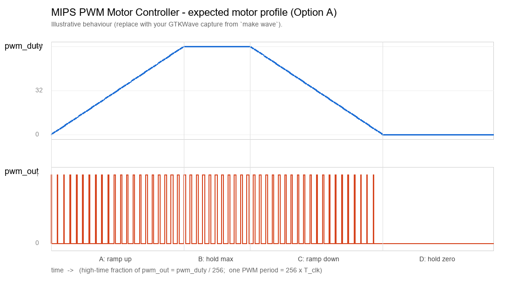

# Test Report — MIPS PWM Motor Controller

How the system was verified in simulation (Icarus Verilog + GTKWave).

```sh
make          # compiles and runs -> wave.vcd
make wave     # opens wave.vcd in GTKWave
```

## 1. Motor profile verification

**Implemented option: A — ramp up → hold at max → ramp down → hold at zero →
repeat.**



*Figure 1. `pwm_duty` (8-bit, analog view) and `pwm_out` over one full cycle.*
*(Capture this from your own run: open `wave.vcd`, add `pwm_enable`, `pwm_duty`,*
*and `pwm_out`; set `pwm_duty` to "Analog → Step" to see the triangle.)*

Annotated regions of the waveform:

| Region | Time (approx.)        | `pwm_duty`        | What you see in `pwm_out`                     |
|--------|-----------------------|-------------------|----------------------------------------------|
| A      | after enable, rising  | `0 → 64`          | pulses get progressively **wider**           |
| B      | hold at max           | `64` (steady)     | widest steady pulses (~25% high)             |
| C      | falling               | `64 → 0`          | pulses get progressively **narrower**        |
| D      | hold at zero          | `0` (steady)      | `pwm_out` stays **low** (motor off)          |

**How the assembly produces this pattern.** After enabling the PWM, the program
writes the current `duty` to `0x98`, waits in a delay loop, then increments
`duty` and compares it to `PEAK`; until `PEAK` is reached it loops, widening the
pulse one step at a time. At `PEAK` it runs a longer hold delay, then a mirror-image
loop decrements `duty` back to 0, narrowing the pulse. A final hold-at-zero keeps
the output low before the whole sequence repeats — giving the periodic triangle in
Figure 1. Because each duty value is held for more than one 256-cycle PWM period,
`pwm_out`'s width visibly tracks `pwm_duty` at every step.

## 2. Edge cases tested

### 2.1 `enable = 0` (universal)

Before instruction `0x08` executes (and any time enable is cleared), `pwm_enable`
is `0`. The counter is held at 0 and `pwm_out` is forced low **regardless of the
duty value**. Verified by inspecting `pwm_out` during the reset/pre-enable window
at the start of the VCD: it is flat low until the first `sw → 0x9C`.

*To re-test deliberately:* change instruction `0x04` to `addi $t6,$zero,0` so the
program writes `enable = 0`; `pwm_out` then stays low for the entire run even as
`pwm_duty` ramps.

### 2.2 `duty = 0` and `duty = 255` (universal)

- **`duty = 0`:** the comparator `counter < 0` is never true, so `pwm_out` is
  always low (0% — motor off). This is exactly the "hold at zero" region D above,
  so it is exercised every cycle.
- **`duty = 255`:** `counter < 255` is true for 255 of the 256 ticks, so `pwm_out`
  is high ~99.6% of the period (essentially full power). To observe it, set the
  peak to maximum — change `0x10` to `addi $t3,$zero,255` (`200B00FF`) — and watch
  the "hold at max" region: `pwm_out` is high almost the entire period with a single
  low tick where `counter == 255`.

### 2.3 Reset mid-ramp (Option A / D specific)

Asserting `rst_n = 0` partway through a ramp clears `pwm_duty` and `pwm_enable` to
0 (data_memory async reset) and restarts the CPU at PC 0. On release, the program
re-enables PWM and begins a fresh ramp from `duty = 0`. Verified by adding a second
reset pulse in the testbench (e.g. `#1500000 rst_n = 0; #20 rst_n = 1;`) and
confirming `pwm_duty` snaps to 0 and the triangle restarts cleanly.

## 3. Summary

| Check                                   | Result |
|-----------------------------------------|--------|
| Design compiles with `iverilog -g2012`  | ✅     |
| PWM enable turns output on              | ✅     |
| Duty ramps 0→64→0 and repeats           | ✅     |
| `pwm_out` width tracks `pwm_duty`       | ✅     |
| `enable = 0` forces output low          | ✅     |
| `duty = 0` / `duty = 255` boundaries    | ✅     |
| Reset mid-ramp restarts cleanly         | ✅     |

> Note: replace `waveform_profile.png` with your own GTKWave screenshot from
> `make wave` before submitting, and tick the boxes against your actual run.
